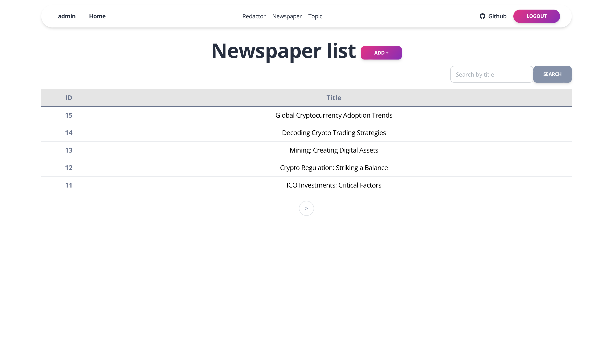

Python must be already installed:

```shell
git clone https://github.com/DenPrislipskyi/newspaper-agency.git
cd newspaper_agency
```
for macOS:
```shell
python3 -m venv venv
source venv/bin/activate
```

for windows:
```shell
python -m venv venv
source venv/scripts/activate
```

Set up requirements
```shell
pip install -r requirements.txt
```


Use the following command to load prepared data from fixture to test and debug my website:
```shell
python manage.py loaddata newspaper_agency.db.data.json
```
(You also manually populate the database and continue to argument it)

After loading data from fixture you can use following superuser (or create another one by yourself)
```shell
username: admin
password: admin
```

Use the following command to run server:
```shell
python manage.py runserver
```

# newspaper agency


This project aims to create a system that ensures we always know which editors are responsible 
for publishing each newspaper. The system tracks the association between editors and newspapers.


On the main page, you can see the number of newspaper redactors and topics.


On the Redactor page, you can view all Redactors. Only the superuser can create, edit, delete, and add new editors.
Ordinary Redactors can only delete and edit their own accounts. When registering or modifying a regular Redactor,
the ```redactor_id``` must consist of the first three capital letters followed by five numbers. 
Additionally, clicking on a Redactor's username allows you to view detailed information about the editor.


On the Newspaper page, you can view all newspapers. To create a new newspaper,
you need to provide a title, select a topic, and add up to 5 redactors. 
Additionally, clicking on a newspaper title allows you to access detailed information about that specific newspaper.


On the topics page, you can view all topics and add new topics.

